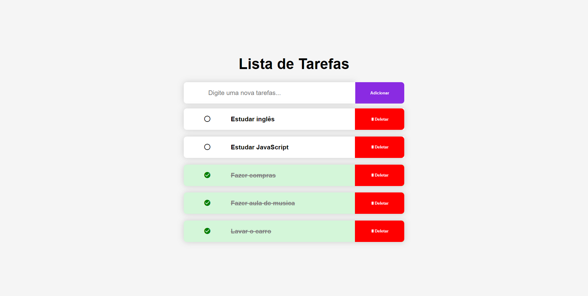

# Lista de Tarefas

## Visão Geral

### Projeto de uma aplicação Web de lista de tarefas, simples e prática, para organizar as tarefas do seu dia a dia.
#




### Construido com:
- HTML
- CSS
- JavaScript

## Funcionalidades
- Cria lista de tarefas de forma rápida e simples.
- Para marcar a tarefa como feita, basta dar um clique na tarefa que deseja marcar.
- Botão deletar tarefa. 
- Adiciona nova tarefa clicando com o botão Enter do teclado.

## O que eu aprendi:
- Manipulação do DOM

- Boas práticas com JavaScript

- Eventos de click na página
```js
input.addEventListener('keyup', function (event) {
  if (event.keyCode === 13) {
    event.preventDefault()
    btnAdd.click()
  }
})
```
- Métodos e propriedades do JS
```js
  input.focus() 
  item.classList.remove()
  item.classList.add()
  item.getAttribute()
```


## Link

Veja o projeto aqui: [Acessar🌍](https://devhiderlan.github.io/lista-de-tarefas/) 

## Autor

Hiderlan Santana: [Linkedin](https://www.linkedin.com/in/hiderlan-santana/)
